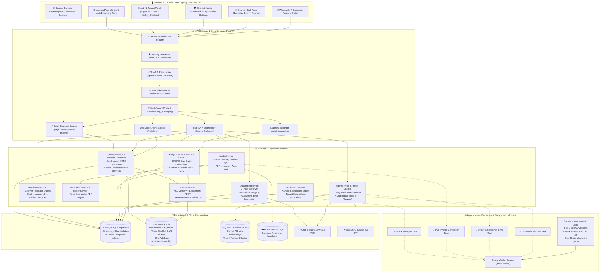
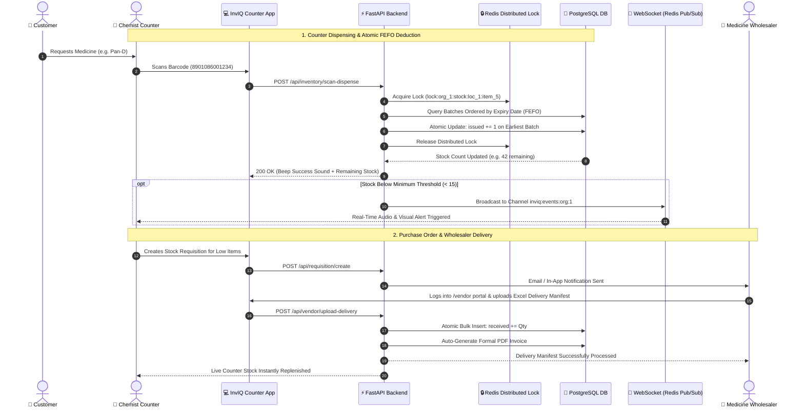
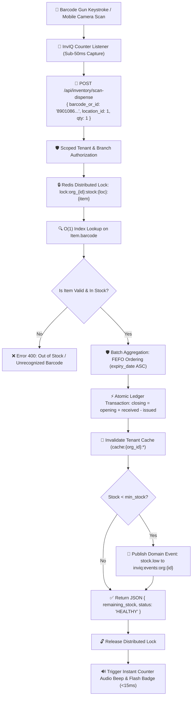
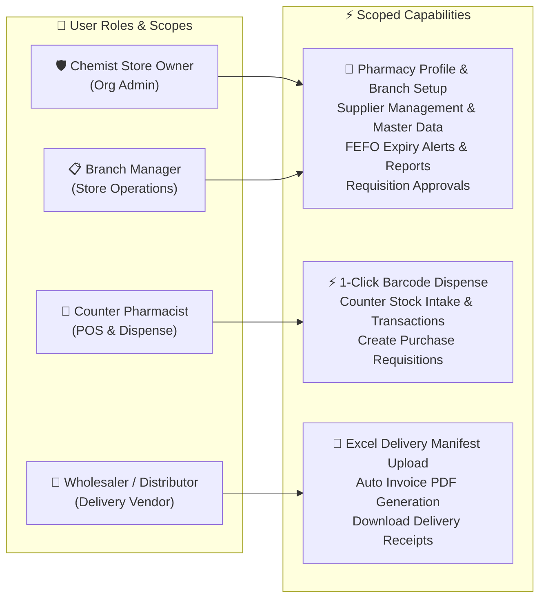

# 🏥 InvIQ - AI-Powered Retail Chemist & Multi-Pharmacy Inventory Operating System

**Smart AI inventory, FEFO expiry loss prevention, barcode quick-dispensing, and distributor Excel synchronization for retail medical stores and pharmacy chains.**

---

## 🎯 Problem It Solves

Independent retail medical stores and local pharmacy chains in Tier-2/3 cities lose significant revenue every month due to **expired medications (FEFO loss)**, missed customer sales from sudden stockouts, and manual paper-heavy distributor bills. **InvIQ provides a simple, ultra-fast, mobile-friendly platform tailored specifically for chemist shop owners:**

1. **Zero Expiry Loss (FEFO)**: Real-time alerts at 30, 60, and 90 days before batch expiration so chemists can return stock to distributors on time.
2. **Instant Barcode Quick Dispense**: Connected USB/Bluetooth barcode scanner and camera dispense endpoint that removes sold items one-by-one with millisecond consistency.
3. **1-Click Distributor Bill Ingest**: Upload wholesaler Excel/CSV delivery manifests to auto-increment live stock in seconds.
4. **Single & Multi-Shop Chains**: Centralized dashboard to track stock across 1 to 10+ shop counters from a phone or tablet.

---

## 🛠️ Tech Stack

### Backend & Cloud Infrastructure


### Frontend


### AI & Barcode Infrastructure


---

## ✨ Key Capabilities

- ⚡ **Ultra-Fast Barcode Scanner Dispensing** - Instant 1-by-1 stock deduction on counter scan with zero latency and PostgreSQL transaction advisory locking.
- 💊 **Unit of Measure (UOM) Granularity & Multi-Packaging** - Atomic smallest-unit ledger (`tablet`, `ml`, `vial`) with multi-tier packaging conversions (`strip`, `box`, `case`), single-dose 1-tablet strip handling, and hierarchical stock decomposition visualizers.
- 🛒 **Counter Billing Cart & Flexible Customer Discounts** - High-speed barcode retail billing session with live discount previews (`none`, `flat`, `tiered` slabs), receipt generation, instant stock locking, and zero-drift void cancellation.
- 📈 **Real-Time Monthly Sales & Gross Margin KPIs** - Sub-millisecond sales, discounts, revenue, and gross profit analytics backed by Redis pipeline caching and Celery background workers.
- 📦 **FEFO Expiry Loss Shield** - Proactive batch alerts at 30, 60, and 90 days ensuring no expired medicine remains on shelves.
- 🚚 **Supplier & Distributor Management** - Direct vendor portal with 1-click Excel delivery manifest ingestion and automated PDF invoices stored in Azure Blob Storage.
- 🤖 **AI Chemist Assistant** - Ask questions in plain English or Hindi: *"What medicines are running low in Counter 1?"*
- 📊 **Real-Time Clean Analytics** - Live stock count, critical shortages, cold-chain fridge monitor, and store-by-store breakdowns.
- 🔐 **Enterprise Multi-Tenant Security** - Strict non-nullable `org_id` schema, HttpOnly SameSite auth cookies, CSP headers, issued-at (`iat`) token invalidation, cryptographic Google OAuth ID-token verification, and tenant-scoped Redis pub/sub.
- ☁️ **Dual Environment Architecture** - Strictly separated `DEVELOPMENT` (local dev & rapid testing) and `PRODUCTION` (containerized Azure App Service / Cloud with Alembic migrations).
- ✅ **Production Test Suite** - Comprehensive 342+ test cases covering unit conversions, billing lifecycles, RBAC, multi-tenancy, and FEFO dispensing with 100% pass rate.

---

## 🚀 Quick Setup & Environments

InvIQ has exactly **TWO environments**:
1. **DEVELOPMENT** — Local machine development and manual testing.
2. **PRODUCTION** — Deployed cloud environment (Azure App Service + Azure Blob Storage + Supabase Postgres + Upstash Redis).

### 1. Local Development Setup

```bash
# 1. Clone repository
git clone https://github.com/Sayandip05/InvIQ.git
cd InvIQ

# 2. Set up Python virtual environment
python -m venv venv
source venv/bin/activate  # On Windows: venv\Scripts\activate
pip install -r requirements.txt

# 3. Configure local environment
cp .env.example .env
# Ensure ENVIRONMENT=development in your .env

# 4. Run database migrations (or let dev server auto-create)
./venv/bin/alembic -c backend/alembic.ini upgrade head

# 5. Start Backend development server
cd backend
uvicorn app.main:app --reload --port 8000
```

### 2. Frontend Development Setup

```bash
# In a new terminal
cd frontend
npm install
npm run dev
# Frontend runs at http://localhost:5173
```

### 3. Production Deployment (Azure App Service / Docker)

The project uses a unified multi-stage `Dockerfile`. In production (`ENVIRONMENT=production`), the container automatically applies Alembic migrations on boot before starting Gunicorn workers:

```bash
# Run via Docker Compose (or deploy Docker image to Azure App Service)
docker compose up -d --build
```

---

## 🏗️ Future-Proof System Architecture

### 1. Full-Stack & Cloud Infrastructure Architecture



---

### 2. Retail Chemist & Distributor Supply Chain Lifecycle



---

### 3. High-Speed Barcode Quick-Dispense Engine



---

## 👥 Role-Based Access Control (RBAC) & User Journeys




---


---

## 🔷 GraphQL Analytics API

InvIQ uses a **REST + GraphQL hybrid** — the industry-standard pattern. REST handles all mutations (create/update/delete). GraphQL handles analytics reads with zero over-fetching.

**Endpoint:** `POST /graphql/analytics`  
**Playground (dev):** `GET /graphql/analytics`

### Available Queries

```graphql
# Dashboard chart data
{ dashboardStats {
    categoryDistribution { name value }
    lowStockItems { name stock minStock shortage }
    statusDistribution { name value color }
} }

# Full heatmap grid
{ heatmap { locations items matrix
    details { itemName currentStock healthStatus }
} }

# Stock alerts with filter
{ alerts(severity: "CRITICAL") {
    count alerts { itemName currentStock recommendedReorder }
} }

# Aggregate summary
{ summary {
    healthSummary { critical warning healthy }
    categories { name total critical }
} }

# Flexible ad-hoc query with server-side filters
{ stockHealth(location: "Warehouse", statusFilter: "CRITICAL") {
    itemName currentStock avgDailyUsage daysRemaining
} }
```

### Role-Aware Field Masking

| Caller | `avgDailyUsage` | `daysRemaining` | `leadTimeDays` |
|--------|:---:|:---:|:---:|
| Guest / Vendor | `null` | `null` | `null` |
| Manager / Admin | ✅ | ✅ | ✅ |

---

## 📚 Documentation

For detailed documentation, see the `/docs` folder:

- **[High-Level Design (HLD)](docs/HLD.md)** - System overview, architecture, tech stack decisions
- **[API Reference](docs/api.md)** - REST + GraphQL endpoint reference

---

## 🧪 Testing & Quality Assurance

```bash
# Run all automated tests (344 test cases across Unit, Integration, API, E2E)
./venv/bin/pytest backend/tests/ -v

# Run by testing category
./venv/bin/pytest backend/tests/unit/ -v          # Unit Tests
./venv/bin/pytest backend/tests/integration/ -v   # Integration & Multi-tenant Tests
./venv/bin/pytest backend/tests/api/ -v           # REST & GraphQL API Tests
./venv/bin/pytest backend/tests/e2e/ -v           # End-to-End Workflow Tests

# Run with coverage report
./venv/bin/pytest backend/tests/ --cov=app --cov-report=term-missing
```

---

## ⚡ Performance Benchmarks

The benchmark suite is located in `backend/tests/benchmark/`:

```bash
# 1. Run concurrency and throughput latency benchmark
cd backend
../venv/bin/python tests/benchmark/run_latency_benchmark.py

# 2. Run Locust load testing suite
../venv/bin/locust -f tests/benchmark/locustfile.py --headless -u 100 -r 10 --run-time 1m --host http://localhost:8000
```

---

## 📦 Project Structure

```
InvIQ/
├── backend/
│   ├── alembic/                  # Version-controlled database migrations
│   ├── alembic.ini               # Portable migration configuration
│   ├── app/
│   │   ├── api/
│   │   │   ├── routes/           # REST routes (auth, inventory, vendor, requisition, admin…)
│   │   │   ├── schemas/          # Pydantic validation schemas with password complexity
│   │   │   └── graphql/          # Strawberry GraphQL (resolvers, schema, role masking)
│   │   ├── application/          # Domain services (inventory, vendor, data import, analytics…)
│   │   ├── core/                 # Config, security (Argon2id, JWT, Google OAuth), middleware
│   │   ├── infrastructure/       # Database models/repos, Upstash Redis, Azure Blob Storage, Qdrant
│   │   └── workers/              # Celery background task processing & Celery Beat
│   ├── scripts/                  # Database migration fixtures and demo seeding utilities
│   └── tests/                    # 344 automated test cases & benchmark suite
│       ├── unit/                 # Domain, service, exception, security unit tests
│       ├── integration/          # Multi-tenant isolation, UoM, import, event pipeline
│       ├── api/                  # REST, GraphQL, WebSocket, Billing endpoints
│       ├── e2e/                  # Daily operations, onboarding, master data workflows
│       └── benchmark/            # Concurrency benchmarks, Locust load tests, latency profiling
├── frontend/
│   ├── src/
│   │   ├── components/           # Reusable React components & Tailwind styles
│   │   ├── pages/                # Admin, counter staff, and vendor portal views
│   │   ├── context/              # Auth, multi-tenant organization & WebSocket alert context
│   │   └── services/             # Axios API client with automatic token refresh
│   └── package.json
├── docs/                         # HLD, DECISIONS, FLOW, and API reference
├── Dockerfile                    # Unified multi-stage production Dockerfile
├── docker-compose.yml            # Local dev orchestration
└── README.md
```

---

## 🔐 Security Features

- **Multi-Tenant Data Isolation** - Strict non-nullable `org_id` on all tenant entities; complete isolation between pharmacy organizations (one admin cannot view or access another pharmacy's data).
- **JWT Authentication** - Short-lived access tokens (30min) + refresh tokens (7 days) with `iat` revocation on password reset.
- **Argon2id Password Hashing** - GPU/ASIC cracking resistant algorithm with unified complexity validation.
- **Google OAuth ID Token Verification** - Cryptographic verification via `google-auth` with mandatory email verification and audience matching.
- **Postgres Advisory Locking** - Transaction-level concurrency lock on `(location_id, item_id)` for zero race conditions.
- **Rate Limiting** - SlowAPI sliding-window limiter backed by Upstash Redis TLS.
- **Token Blacklist** - Immediate logout token revocation in Redis.
- **Login Lockout** - 5 failed attempts → 15-minute brute-force lockout.
- **Role-Based Access Control** - Role hierarchy (`admin`, `manager`, `staff`, `vendor`) with tenant scoping and GraphQL field masking.
- **Audit Logging** - Tenant-scoped immutable audit trail tracking all state-altering events.

---

## 🤝 Contributing

Contributions are welcome! Please follow these steps:

1. Fork the repository
2. Create a feature branch (`git checkout -b feature/amazing-feature`)
3. Commit your changes (`git commit -m 'Add amazing feature'`)
4. Push to the branch (`git push origin feature/amazing-feature`)
5. Open a Pull Request

---

## 📄 License

This project is licensed under the MIT License - see the [LICENSE](LICENSE) file for details.

---

## 👨‍💻 Author

**Sayandip Bar**

[](http://www.linkedin.com/in/sayandipbar2005)
[](https://github.com/Sayandip05)
[](mailto:sayandip@inviq.io)

---

## 🙏 Acknowledgments

- **FastAPI** - Modern Python web framework
- **Strawberry GraphQL** - Code-first GraphQL for Python
- **LangChain/LangGraph** - AI agent orchestration
- **Groq** - Fast LLM inference
- **Supabase** - Managed PostgreSQL & Realtime
- **Upstash** - Serverless Redis
- **ChromaDB** - Vector database for RAG

---

## 📊 Project Stats


---

<div align="center">
  <p>Made with ❤️ for healthcare professionals</p>
  <p>⭐ Star this repo if you find it helpful!</p>
</div>
